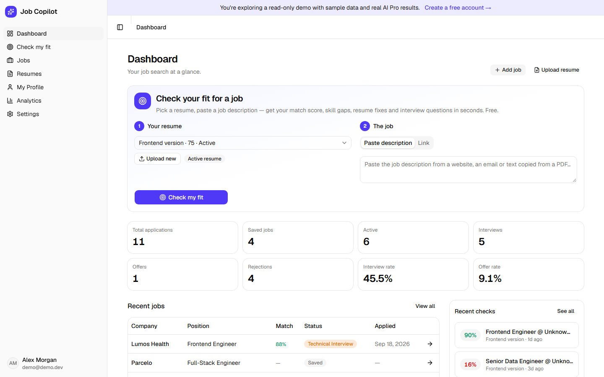
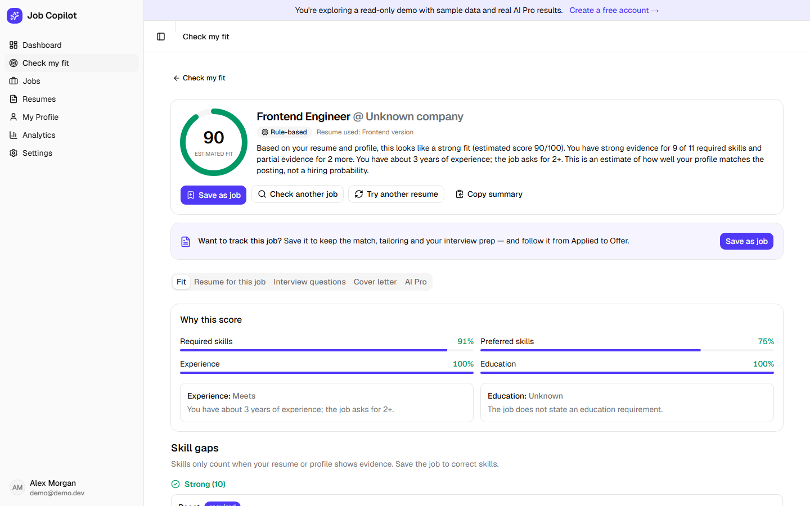
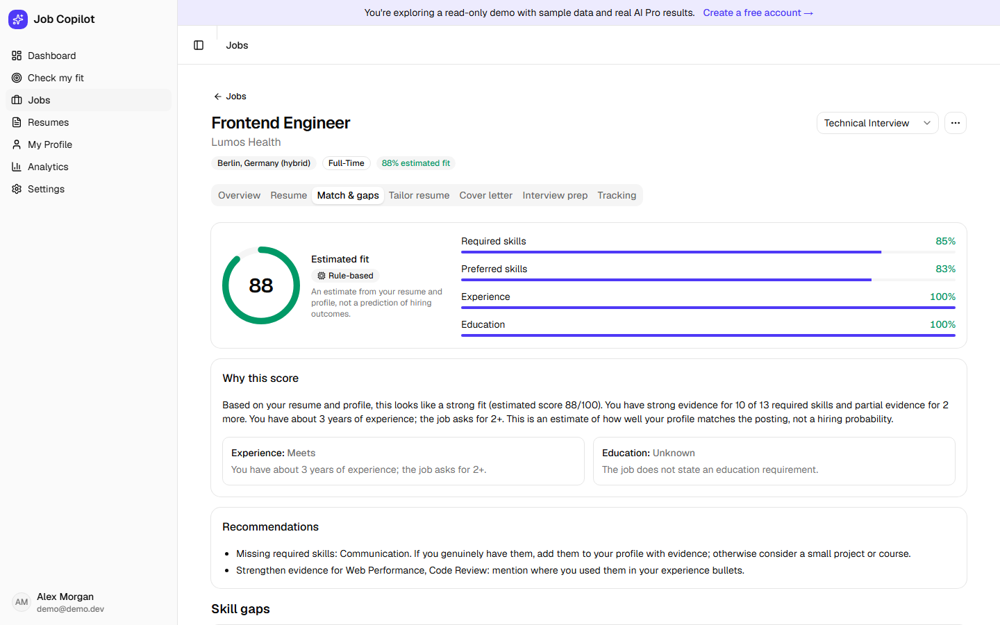
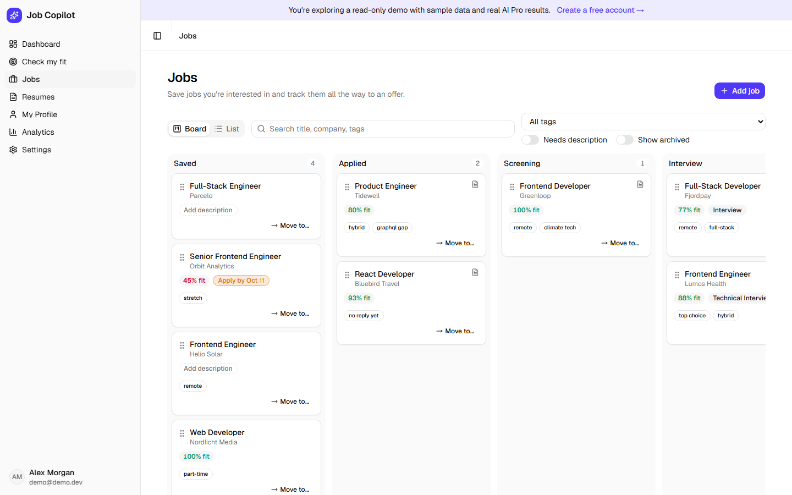
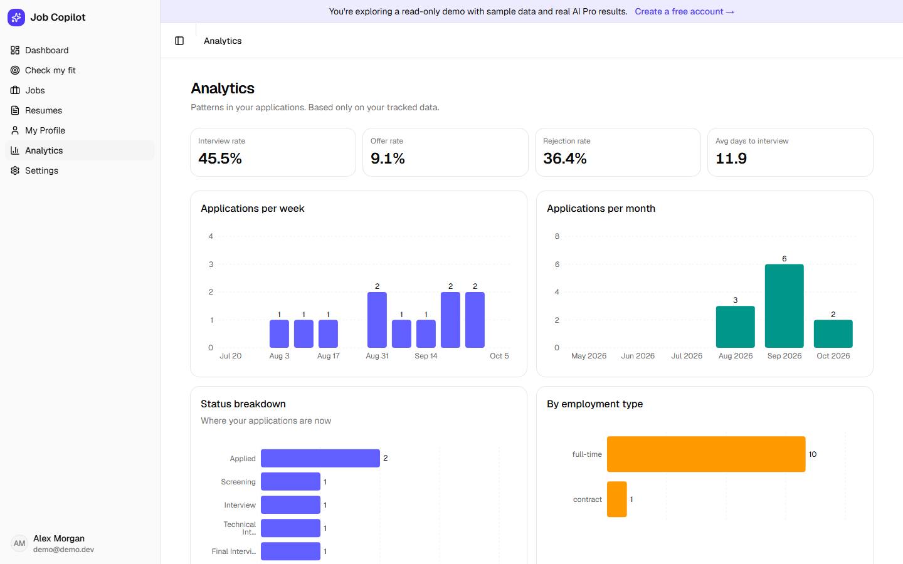
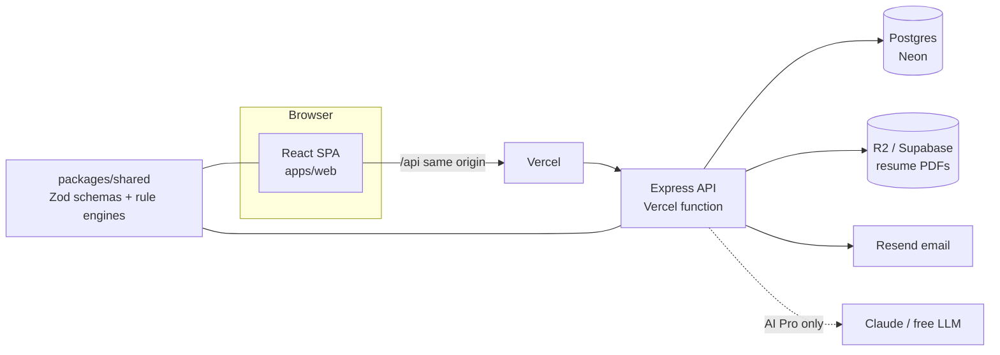

# AI Job Application Copilot

Paste a job description, pick your resume and see how well your **real** experience fits: an
estimated match score, skill gaps, resume fixes, tailoring suggestions, interview questions and a
cover letter — then track the job from *Saved* to *Offer*.

- **Free tier, $0 to run:** every feature has a deterministic, rule-based engine (no LLM calls).
- **AI Pro, invite-only:** Claude (or any OpenAI-compatible free tier) adds explanations and
  rewrites on top of the rules result. Admins approve access; daily and monthly caps keep cost bounded.
- **Guardrails:** never invents candidate facts or metrics, scores come from the rules engine
  (the LLM only adds text), every AI result is labelled and editable.

**Live:** https://ai-job-application-copilot-eight.vercel.app → "Try the live demo" (read-only sample account with pre-generated AI results).



| Check my fit | Job match & gaps |
|---|---|
|  |  |
| **Jobs board** | **Analytics** |
|  |  |

## Features
- **Check my fit** — resume + job description (or a Greenhouse/Lever/JSON-LD link) → estimated fit, strong/partial/missing skills with evidence, resume fixes, interview questions, cover letter — before saving anything.
- **Resumes** — PDF upload, parsing, ATS-style checklist score with concrete fixes, multiple versions.
- **Jobs** — Kanban board + list, status history, contacts, what you sent (resume version, letter, attachments).
- **Job assistant** — match & gaps with skill corrections, tailoring suggestions you accept/reject, cover letters, interview prep and mock interviews with answer feedback.
- **Dashboard & analytics** — pipeline stats, next steps, conversion and response charts.
- **Accounts** — self-built auth (Argon2id, HMAC-hashed session cookies, password reset by email), admin approval for AI Pro.

## Architecture


| Layer | Stack |
|---|---|
| Web | React 19, Vite, TypeScript, Tailwind v4 + shadcn/ui, TanStack Query, React Hook Form + Zod, Recharts |
| API | Express 5, Prisma 7 (pg adapter), Zod validation, pino, helmet, rate limits, SSRF-guarded URL import |
| Shared | Zod contracts + pure rule-based engines (resume parser/analyzer, job parser, matcher, tailoring, cover letter, interview, analytics) used by both apps |
| AI Pro | Anthropic SDK with structured outputs, or any OpenAI-compatible endpoint; quotas, guardrails, usage log |
| Tests | Vitest (engines, web), Supertest on embedded PGlite (API), Playwright end-to-end |
| Hosting ($0, no card) | Vercel (static site + API as one serverless function) · Neon free · Supabase Storage / Cloudflare R2 · Resend |

## Run locally
Requires Node 22+ and pnpm 10.
```bash
pnpm install
cp apps/api/.env.example apps/api/.env   # then set DATABASE_URL + SESSION_SECRET
pnpm db:local                            # optional: embedded Postgres on :5433 (no install)
pnpm --filter api db:migrate
pnpm dev:all                             # web http://localhost:5173 + API :4000
```
Without the API (`pnpm dev` only) the web app runs as an offline prototype on mock data.

| Command | What it does |
|---|---|
| `pnpm test` | unit + API tests (API tests run on embedded PGlite, no database needed) |
| `pnpm typecheck` · `pnpm lint` · `pnpm build` | checks (also run in CI) |
| `pnpm e2e` | Playwright end-to-end against :5173 (`E2E_BASE_URL=…` for a deployed site; `pnpm e2e:install` once) |
| `pnpm screenshots` | refresh the README screenshots from the demo account |

## Deploy
Step-by-step free-tier guide: [docs/deploy.md](docs/deploy.md) — one Vercel project builds the site and bundles the API into a serverless function (`pnpm vercel-build`).

## License
Portfolio project — all rights reserved unless a license is added.
