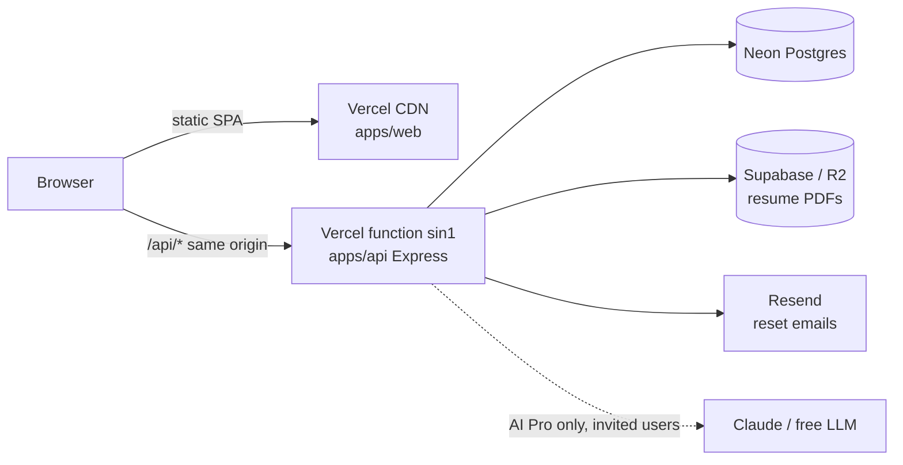

# Deploy guide — $0 go-live (Phase 9)

One Vercel project serves both the web app (static) and the API (one serverless function for
`/api/*`, D24) → Neon free (Postgres) · Supabase Storage or Cloudflare R2 (resume files) · Resend
(reset emails). Same origin keeps the session cookie first-party. No credit card needed.
Config: [vercel.json](../vercel.json) + [apps/api/scripts/build-vercel.mjs](../apps/api/scripts/build-vercel.mjs)
(Build Output API), env reference [apps/api/.env.example](../apps/api/.env.example).

Keep Neon, Supabase and the function in **one region** (this project: Singapore — Neon
`ap-southeast-1`, function `sin1`); every query crosses that link.

## 1. Neon (database)

Project → **Connect**: the **pooled** string → `DATABASE_URL`; with "Connection pooling" off, the
**direct** string → `DIRECT_DATABASE_URL` (migrations only). Prefer a branch separate from local dev.

## 2. File storage (pick one)

- **Supabase Storage** (no card): new project (same region) → Storage → bucket `resumes` (private) → Project Settings → Storage → S3 connection: `S3_ENDPOINT=https://<project>.supabase.co/storage/v1/s3`, `S3_REGION=<project region>`, new access key → `S3_ACCESS_KEY_ID` / `S3_SECRET_ACCESS_KEY`.
- **Cloudflare R2** (card on file): bucket + API token (Object Read & Write) → `S3_ENDPOINT=https://<ACCOUNT_ID>.r2.cloudflarestorage.com`, `S3_REGION=auto`.

`S3_BUCKET` = the bucket name. Buckets stay private — downloads go through the API.

## 3. Resend (password-reset email)

API Keys → create with **Sending access** → `RESEND_API_KEY`. Without a verified domain the sender
`onboarding@resend.dev` only delivers to the Resend account owner's email; placeholder key → emails are only logged.

## 4. Vercel

1. vercel.com → Add New → Project → import the GitHub repo. **Root Directory: leave as the repo root.** Framework Preset: **Other** (`vercel.json` sets install/build commands).
2. Environment Variables (Production + Preview):

| Key                                                                                     | Value                                                                            |
| --------------------------------------------------------------------------------------- | -------------------------------------------------------------------------------- |
| `DATABASE_URL` · `DIRECT_DATABASE_URL`                                                  | Neon pooled · direct                                                             |
| `SESSION_SECRET`                                                                        | `node -e "console.log(require('crypto').randomBytes(32).toString('base64url'))"` |
| `ADMIN_EMAILS`                                                                          | your email                                                                       |
| `S3_ENDPOINT` · `S3_BUCKET` · `S3_REGION` · `S3_ACCESS_KEY_ID` · `S3_SECRET_ACCESS_KEY` | storage                                                                          |
| `RESEND_API_KEY`                                                                        | Resend                                                                           |
| optional `ANTHROPIC_API_KEY` / `AI_API_KEY`                                             | AI Pro (else simulated engine)                                                   |

Defaults set by the function: `STORAGE_DRIVER=s3`, `TRUST_PROXY=1`, `APP_URL` = the deployment's own Vercel URLs (production first).

3. Deploy. The build runs `pnpm vercel-build`: web build → `prisma migrate deploy` → bundle the API function (Singapore). Check `https://<project>.vercel.app/api/health` → `{"data":{"status":"ok"}}`.

## 5. After go-live

- **Try the live demo** → the API seeds the demo account (Alex Morgan) with pre-generated AI results; it reseeds itself on the first demo visit each UTC day.
- Register with an `ADMIN_EMAILS` address → admin (approve AI Pro requests in Settings).
- E2E against prod: Actions → **E2E (deployed)** → Run with the Vercel URL, or `E2E_BASE_URL=https://… pnpm e2e` (creates throwaway `e2e+…@example.com` users).

## Costs & limits

$0: Vercel Hobby (functions: 4.5 MB request bodies → uploads ≤ 4 MB, 60 s max per request, cold start ~1–3 s), Neon free (auto-suspends; first query after idle wakes it), Supabase free 1 GB storage, Resend 3k emails/month. AI Pro only runs for approved users, capped by `AI_DAILY_LIMIT` and `AI_MONTHLY_TOKEN_CAP`. Rate limits are per function instance (in memory).
